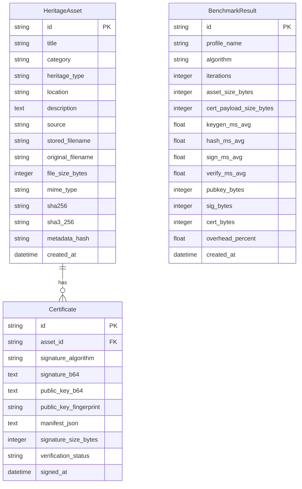

# Database Schema

```mermaid
erDiagram
    HeritageAsset ||--o{ Certificate : "has"
    HeritageAsset {
        string id PK
        string title
        string category
        string heritage_type
        string location
        text description
        string source
        string stored_filename
        string original_filename
        integer file_size_bytes
        string mime_type
        string sha256
        string sha3_256
        string metadata_hash
        datetime created_at
    }
    Certificate {
        string id PK
        string asset_id FK
        string signature_algorithm
        text signature_b64
        text public_key_b64
        string public_key_fingerprint
        text manifest_json
        integer signature_size_bytes
        string verification_status
        datetime signed_at
    }
    BenchmarkResult {
        string id PK
        string profile_name
        string algorithm
        integer iterations
        integer asset_size_bytes
        integer cert_payload_size_bytes
        float keygen_ms_avg
        float hash_ms_avg
        float sign_ms_avg
        float verify_ms_avg
        integer pubkey_bytes
        integer sig_bytes
        integer cert_bytes
        float overhead_percent
        datetime created_at
    }
```
