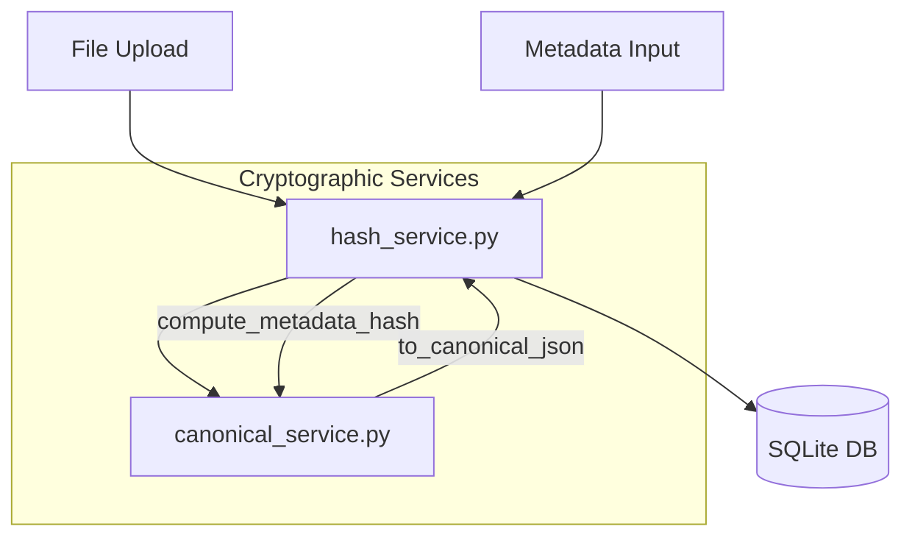

# Service Interaction Graph

## Service Details

### CanonicalService
- Ensures deterministic JSON representation.
- Sorts keys.
- Removes whitespace.
- Uses UTF-8 encoding.

### HashService
- `compute_hashes(data)`: Returns SHA-256 and SHA3-256 for binary data.
- `compute_metadata_hash(metadata)`: Returns SHA-256 of the canonical JSON representation of the metadata.
