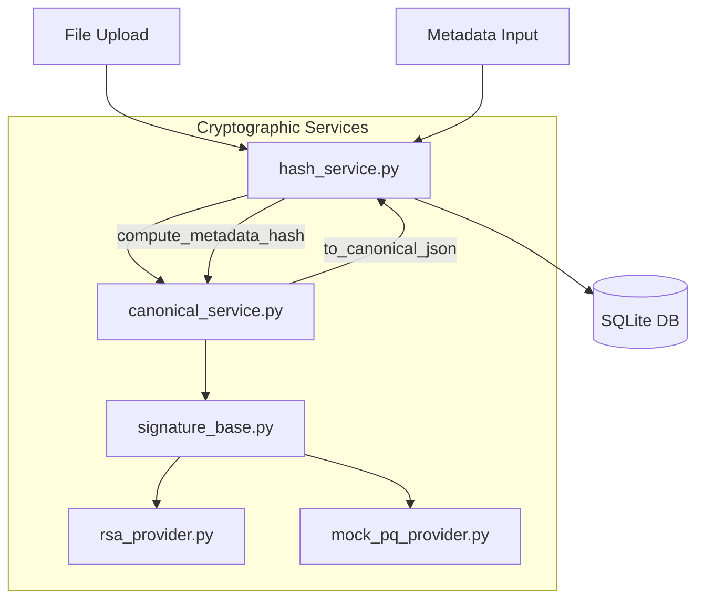

# Service Interaction Graph

## Service Details

### CanonicalService
- Ensures deterministic JSON representation.
- Sorts keys.
- Removes whitespace.
- Uses UTF-8 encoding.

### HashService
- `compute_hashes(data)`: Returns SHA-256 and SHA3-256 for binary data.
- `compute_metadata_hash(metadata)`: Returns SHA-256 of the canonical JSON representation of the metadata.

### Signature Providers
- `SignatureProvider`: Abstract base class defining the interface for signature generation and verification.
- `RSAPSSProvider`: Implements RSA-PSS with 3072-bit keys and SHA-256.
- `MockPQProvider`: Simulates a Post-Quantum signature algorithm (ML-DSA-65) for demonstration purposes, mimicking key sizes, signature sizes, and timing.
